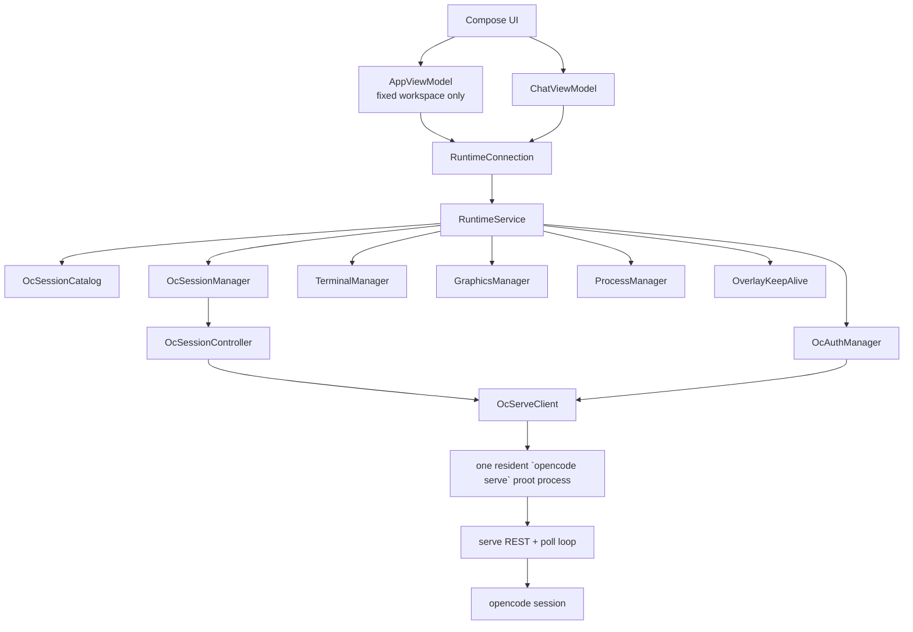
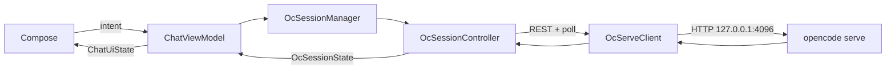

# PIRT architecture

English · [简体中文](architecture.zh-CN.md)

PIRT is an Android projection of OpenCode running in one app-private Debian PRoot environment. OpenCode owns conversations; PIRT owns the Android lifecycle, the shared workspace, and presentation.

## Ownership



There is no Android conversation database and no `workspace.json`. The fixed workspace is `files/pirt/workspace`. The opencode session store under the Debian rootfs is the only persisted conversation catalog and history.

`RuntimeService` owns one resident `opencode serve` proot process through `OcServeClient` (HTTP 127.0.0.1:4096, per-boot basic-auth password). The server owns authentication, models, agents, commands, MCP servers, and all live sessions. Opening or switching conversations does not create another OS process. Activities bind through `RuntimeConnection`; Compose never owns the serve process or its sessions.

`RuntimeService` also owns the persistent shell, graphical desktop, process projection, notification, and overlay. These components therefore do not follow the lifecycle of an individual Compose page. The service runs in the app process and promotes itself with one foreground notification; it is not a separate Android process.

Each live conversation has one `OcSessionController` that polls `GET /session/:id/message` plus `/session/status` while a turn runs. Fork uses `POST /session/:id/fork`; permission prompts detected in status are surfaced as approve/deny dialogs. Deletion removes the server session; ordinary UI navigation keeps controllers alive for fast switching.

The drawer has one stable `New conversation` pre-submit slot, separate from the serve catalog. Its composer text and claimed warm child survive navigation to historical conversations. Submitting promotes that draft handle to a transient live row immediately and creates a fresh empty slot; once the server returns a session id (first prompt), the row is replaced by the matching `GET /session` result. This transient projection is never persisted as an Android conversation catalog.

## New conversation flow

```mermaid
sequenceDiagram
    participant UI as Compose
    participant M as OcSessionManager
    participant P as opencode serve
    participant C as OcSessionCatalog
    UI->>M: open stable pre-submit slot (no server session yet)
    UI->>P: first prompt creates session, returns server id
    UI->>UI: promote draft to transient live row; create fresh slot
    M->>C: refresh after turn completes
    C->>P: GET /session
    C-->>UI: id, title, timestamps
```

Before the server returns its identity, Android has only an ephemeral draft handle. That handle is not a session ID and is never persisted. The display name falls back to the first message until the server title exists.

Persisted sessions resume by server id. Renaming uses `PATCH /session/:id` (`title`); deleting uses `DELETE /session/:id`. There is no archive state.

## Chat data flow



`OcSessionController` is the only state reducer: message polling plus status polling fold into `OcSessionState`. Serve stderr and unknown JSON shapes go to runtime diagnostics, not chat.

## Other OpenCode-owned data

The resident `opencode serve` owns providers, models, agents, slash commands, MCP servers, and sessions. Android keeps only UI projections; it does not maintain a provider registry, credential store, model catalog, conversation catalog, agent loop, or session parser.

Conversation operations map to serve REST calls. Fork uses `POST /session/:id/fork`; a follow-up message stands in for steering; slash commands run through `POST /session/:id/command`. Android projects server message IDs as branch anchors; it does not maintain a parallel branch or queue model.

## Runtime filesystem

```text
files/pirt/
  workspace/                         shared host workspace
  runtime/
    debian/
      root/.config/opencode/              opencode.json, auth, sessions
      usr/local/bin/opencode              pinned CLI (APK asset)
      usr/local/bin/open-computer-use     computer-use MCP (APK asset)
    native-links/
```

Every serve, terminal, and desktop process mounts the same host workspace at `/workspace`. Conversations isolate OpenCode history, not files. PIRT does not manage Git repositories, branches, worktrees, checkpoints, diffs, or rollback.

`WorkspaceDocumentsProvider` projects that same app-private workspace into Android's Storage Access Framework as the `PIRT / Workspace` document root. System file managers and SAF-aware apps operate on the original files through content URIs; PIRT does not copy, mirror, or relocate the workspace.

## Long-running processes and background activity

Commands started in the Debian environment are not owned by an OpenCode conversation. They can continue after the user switches conversations or leaves the chat page, which allows workloads such as a Minecraft server to run independently. `ProcessManager` projects the host/PRoot process tree into the UI and can terminate a selected process; it does not store a second process database.

`RuntimeService` keeps the runtime visible to Android through its foreground notification. It holds a partial wake lock only while an OpenCode session is busy or the persistent terminal is active, and releases it when those conditions end. When enabled, the application overlay keeps the app active while it is in the background and exposes compact chat/process controls. The overlay and service improve background continuity but remain subject to Android's process-management policy.

## Graphical desktop

`GraphicsManager` starts one service-owned graphics stack inside the same PRoot environment:

```
XFCE on DISPLAY=:100
        ↓
TigerVNC on 127.0.0.1:6000 (VncAuth, localhost-only)
        ↓
embedded AVNC viewer (in-APK, tiny-computer/avnc library)
```

The display number is fixed by `PRootRuntime.GRAPHICS_DISPLAY = 100`; serve and terminal processes also receive `DISPLAY=:100`. The VNC listener binds to localhost. There is no websockify/noVNC layer in this fork: the Android UI opens the desktop through the embedded AVNC viewer, or passes the local VNC address and password to an external client.

The seeded opencode context tells the Agent to prefer `DISPLAY=:100` for desktop inspection, screenshots, and GUI interaction (open-computer-use MCP tools). If that display is unavailable, it asks the user to start **Desktop** from the app sidebar rather than guessing another display.
