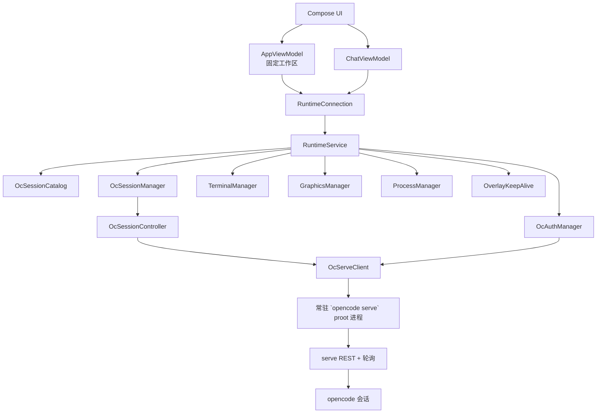
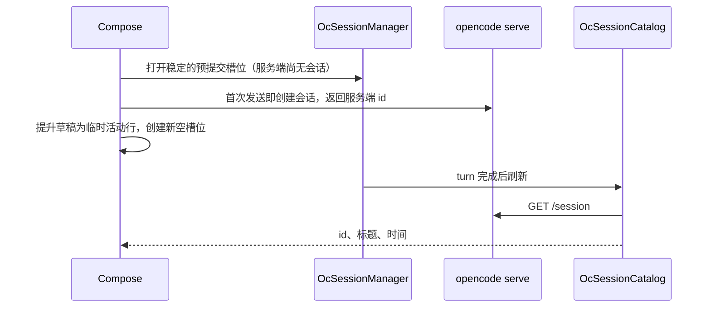
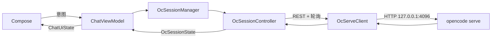

# PIRT 架构

[English](architecture.md) · 简体中文

PIRT 把运行在应用私有 Debian PRoot 环境中的 OpenCode 投射为 Android 应用。OpenCode 负责会话；PIRT 负责 Android 生命周期、共享工作区和移动端呈现。

## 组件归属



Android 端没有会话数据库，也没有 `workspace.json`。固定工作区是 `files/pirt/workspace`；Debian Rootfs 下的 opencode 会话存储是唯一持久化会话目录和历史。

`RuntimeService` 通过 `OcServeClient` 持有一个常驻的 `opencode serve` proot 进程（HTTP 127.0.0.1:4096，每次启动随机 basic-auth 密码）。服务端持有认证、模型、Agent、命令、MCP 服务和所有活动会话。打开或切换会话不会创建新的系统进程。Activity 通过 `RuntimeConnection` 绑定服务，Compose 页面不持有 serve 进程或其会话。

`RuntimeService` 还持有持久 Shell、图形桌面、进程投影、通知和悬浮窗，所以离开某个 Compose 页面不会停止这些组件。服务与界面运行在同一个 Android 进程中，通过一条前台通知提高进程重要性，并非独立 Android 进程。

每个活动会话对应一个 `OcSessionController`，在 turn 运行期间轮询 `GET /session/:id/message` 和 `/session/status`。fork 使用 `POST /session/:id/fork`；状态中检测到的权限请求以允许/拒绝对话框呈现。删除会话即删除服务端会话；普通页面切换不会释放控制器，以便快速恢复。

侧边栏中的“新会话”是一个尚未提交的稳定槽位，与服务端的已持久化会话目录分开。首次发送后，它会立即成为临时活动行，同时创建新的空槽位；服务端返回会话 id 后，再由 `GET /session` 返回的真实记录替换。Android 不会把这个临时投影持久化为另一套会话目录。

## 新会话流程



服务端返回身份之前，Android 只持有临时草稿句柄。它不是会话 ID，也不会持久化。显示名称在服务端标题出现之前回退为首条消息。

恢复历史会话使用服务端 id。重命名使用 `PATCH /session/:id`（`title`）；删除使用 `DELETE /session/:id`。当前没有归档状态。

## 对话数据流



`OcSessionController` 是唯一的状态归并器：消息轮询与状态轮询折叠为 `OcSessionState`。serve 的 stderr 与未知 JSON 结构进入运行诊断，不进入对话气泡。

## 其他由 OpenCode 持有的数据

常驻的 `opencode serve` 持有服务商、模型、Agent、斜杠命令、MCP 服务和会话。Android 只保留 UI 投影，不另行维护服务商注册表、凭据存储、模型目录、会话目录、Agent 循环或会话解析器。

会话操作映射为 serve REST 调用。fork 使用 `POST /session/:id/fork`；后续消息代替 steering；斜杠命令走 `POST /session/:id/command`。Android 投影服务端消息 ID 作为分支锚点，不再维护平行的分支或队列模型。

## 运行时文件系统

```text
files/pirt/
  workspace/                         共享宿主工作区
  runtime/
    debian/
      root/.config/opencode/              opencode.json、认证、会话
      usr/local/bin/opencode              锁定版本 CLI（APK 内资源）
      usr/local/bin/open-computer-use     computer-use MCP（APK 内资源）
    native-links/
```

所有 serve、Shell 和桌面进程把同一个宿主目录挂载为 `/workspace`。会话只隔离 OpenCode 历史，不隔离文件。PIRT 不管理 Git 仓库、分支、worktree、检查点、diff 或回滚。

`WorkspaceDocumentsProvider` 把同一个应用私有工作区投影到 Android 存储访问框架，文档根为 `PIRT / Workspace`。系统文件管理器和支持 SAF 的应用通过 content URI 直接操作原始文件；PIRT 不复制、不镜像、不搬移工作区。

## 常驻进程与后台行为

Debian 环境中启动的命令不归属于某个 OpenCode 会话。切换会话或离开对话页面后，它们仍可继续运行，因此可以承载 Minecraft 服务端等长期任务。`ProcessManager` 把宿主/PRoot 进程树投影到界面，并可终止指定进程；它不维护第二套进程数据库。

`RuntimeService` 通过前台通知让 Android 明确感知正在运行的本地环境。只有 OpenCode 会话忙碌或持久终端活跃时才持有 partial WakeLock，条件结束后立即释放。用户开启悬浮窗后，应用在后台时可继续保持活跃，并提供紧凑的会话与进程入口。前台服务和悬浮窗可以改善后台连续性，但仍受 Android 进程管理策略约束。

## 图形桌面

`GraphicsManager` 在同一个 PRoot 环境中启动一套由服务持有的图形栈：

```text
XFCE on DISPLAY=:100
        ↓
TigerVNC on 127.0.0.1:6000（VncAuth，仅本地回环）
        ↓
内置 AVNC 查看器（APK 内嵌，tiny-computer/avnc 库）
```

显示号固定为 `PRootRuntime.GRAPHICS_DISPLAY = 100`，serve 与终端进程也会收到 `DISPLAY=:100`。VNC 只监听 localhost。本 fork 没有 websockify/noVNC 层：Android 界面通过内置 AVNC 查看器打开桌面，也可以把本地 VNC 地址和密码交给外部客户端。

预置的 opencode 上下文要求 Agent 在桌面检查、截图和 GUI 操作中优先使用 `DISPLAY=:100`（open-computer-use MCP 工具）。如果该显示不可用，Agent 应请用户从应用侧边栏启动“桌面”，而不是猜测其他显示号。
